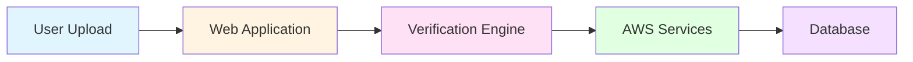
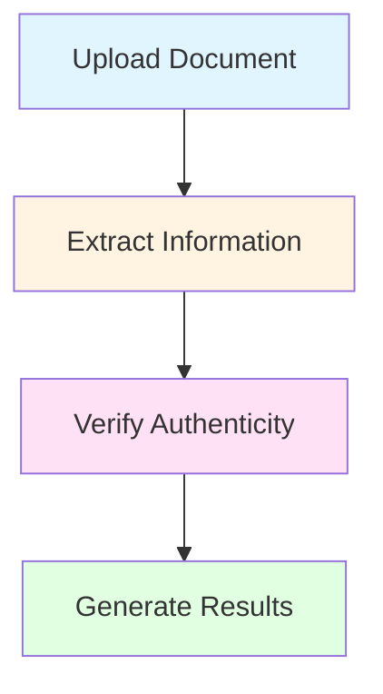
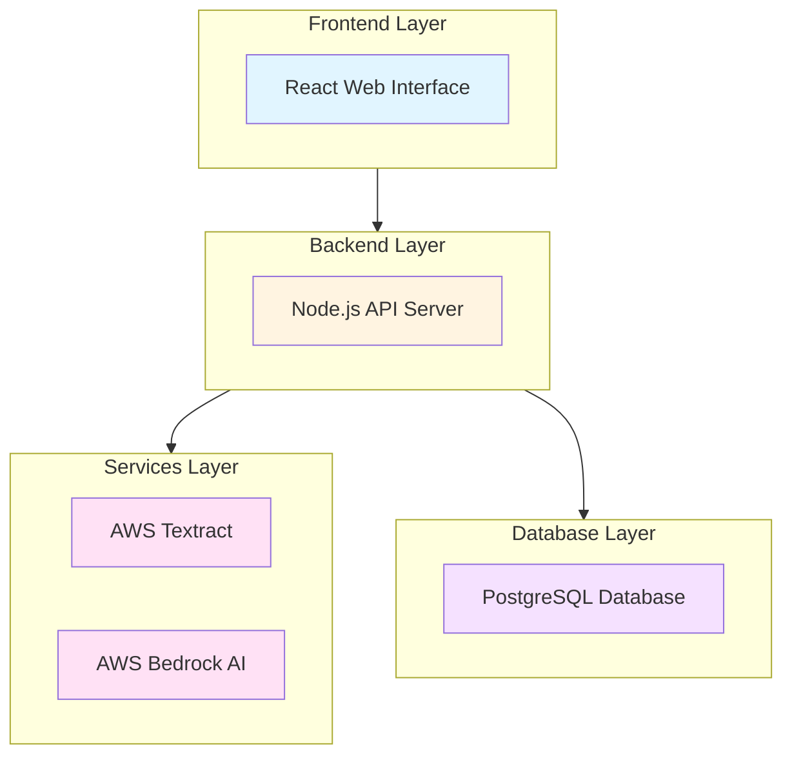
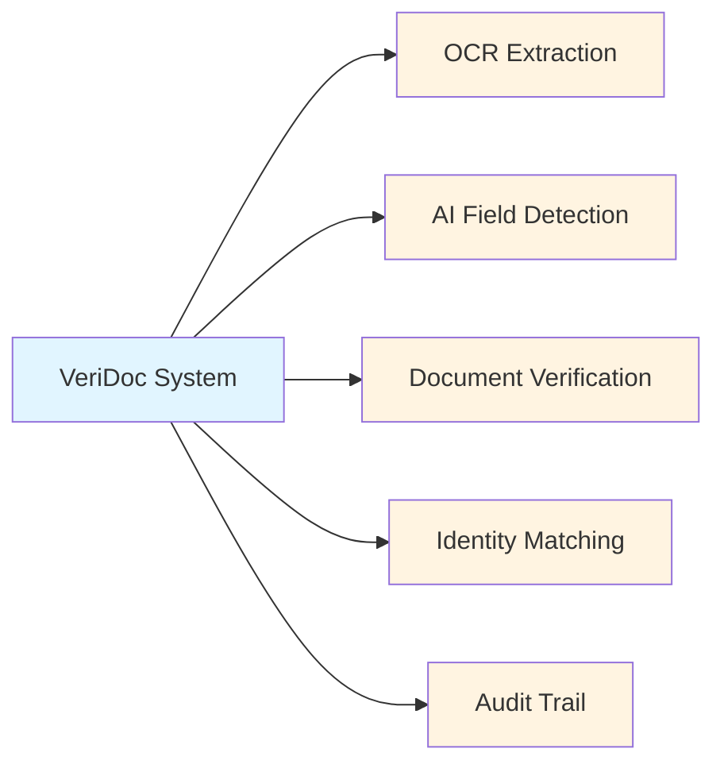
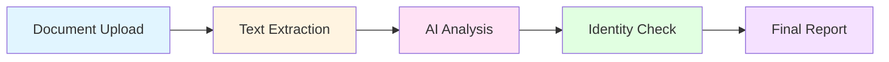
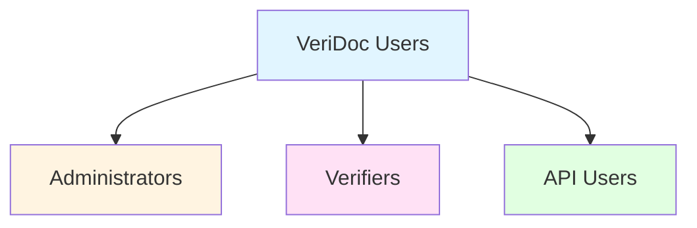
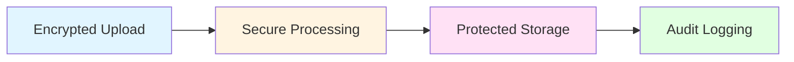
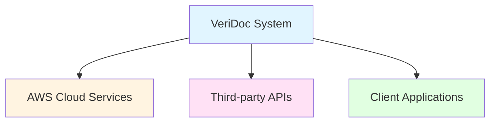

# VeriDoc System - Presentation Diagrams

> **Purpose**: Simple, clean diagrams for PowerPoint/Google Slides presentations to explain the VeriDoc certificate verification system to stakeholders.

---

## 1. High-Level System Overview

**Simple left-to-right flow showing the main components**

**What it shows**: Users upload documents through a web application, which processes them through a verification engine using AWS services, with results stored in a database.

---

## 2. Document Verification Flow

**Top-down flow showing the verification process**

**What it shows**: Four simple steps from document upload to final verification results.

---

## 3. Technology Stack

**Layered architecture showing the technology components**

**What it shows**: Four-layer architecture from user interface to data storage.

---

## 4. Key Features Overview

**Main capabilities of the VeriDoc system**

**What it shows**: Five core features that make up the VeriDoc verification system.

---

## 5. Verification Process Detail

**Expanded view of how documents are verified**

**What it shows**: Five-step process from upload to final verification report.

---

## 6. User Roles

**Different types of users in the system**

**What it shows**: Three main user roles with different access levels.

---

## 7. Data Security Flow

**How data is protected throughout the system**

**What it shows**: Four-stage security process ensuring data protection.

---

## 8. Integration Points

**How VeriDoc connects with external systems**

**What it shows**: Three main integration points for external connectivity.

---

## Usage Guidelines for Presentations

### Slide Layout Recommendations

1. **Title Slide**: Use Diagram 1 (System Overview)
2. **Process Slide**: Use Diagram 2 (Verification Flow)
3. **Technology Slide**: Use Diagram 3 (Technology Stack)
4. **Features Slide**: Use Diagram 4 (Key Features)
5. **Security Slide**: Use Diagram 7 (Data Security)

### Design Tips

- **Background**: Use white or light gray backgrounds
- **Font Size**: Ensure diagram text is readable from the back of the room
- **Colors**: The diagrams use soft, professional colors suitable for business presentations
- **Spacing**: Leave adequate white space around diagrams
- **Annotations**: Add brief bullet points below each diagram to explain key points

### Customization

To customize these diagrams for your presentation:

1. Copy the Mermaid code into a Mermaid editor
2. Adjust colors using the `style` commands
3. Modify text to match your terminology
4. Export as PNG or SVG for PowerPoint/Google Slides

### Rendering Options

**Online Tools**:
- [Mermaid Live Editor](https://mermaid.live)
- [Mermaid Chart](https://www.mermaidchart.com)

**VS Code Extension**:
- Install "Markdown Preview Mermaid Support" extension
- Preview this file to see rendered diagrams

**Export Formats**:
- PNG (recommended for presentations)
- SVG (for high-quality scaling)
- PDF (for print materials)

---

## Presentation Script Suggestions

### For Diagram 1 (System Overview)
> "VeriDoc is a comprehensive document verification system. Users upload documents through our web application, which processes them through our verification engine using AWS cloud services. All results are securely stored in our database for audit and compliance."

### For Diagram 2 (Verification Flow)
> "The verification process is simple and efficient. First, users upload their documents. Second, our AI extracts all relevant information. Third, we verify the document's authenticity. Finally, we generate comprehensive results with confidence scores."

### For Diagram 3 (Technology Stack)
> "VeriDoc is built on modern, enterprise-grade technology. Our React frontend provides an intuitive user experience. The Node.js backend handles all business logic. AWS services power our AI capabilities. And PostgreSQL ensures reliable data storage."

### For Diagram 4 (Key Features)
> "VeriDoc offers five core capabilities: OCR extraction to read documents, AI field detection to identify information, document verification to check authenticity, identity matching to confirm individuals, and complete audit trails for compliance."

---

**Document Version**: 1.0  
**Created**: 2025-10-13  
**Purpose**: Stakeholder Presentations  
**Format**: Mermaid.js Diagrams