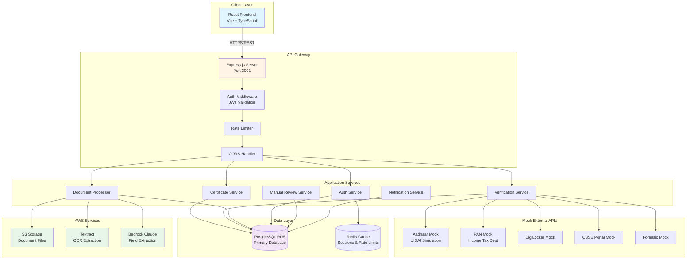
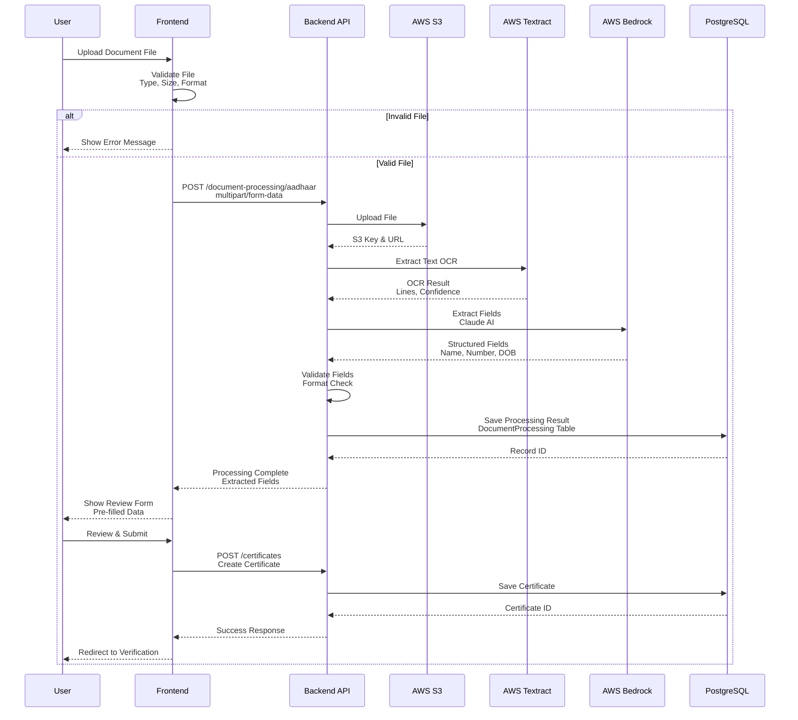
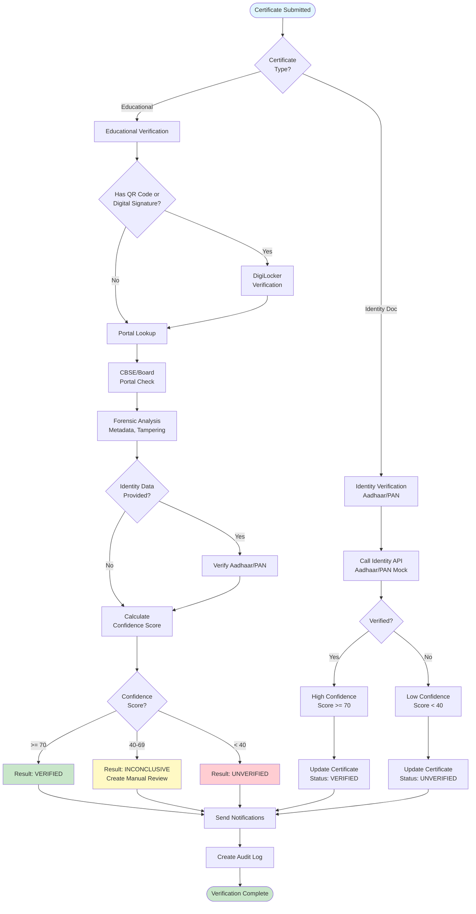
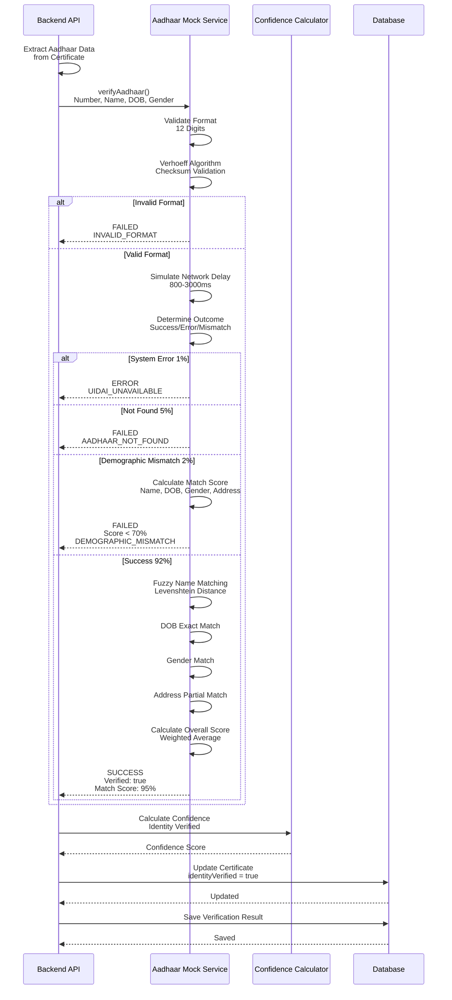
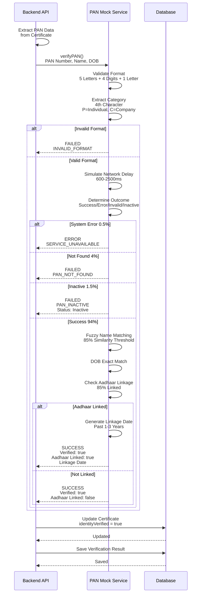
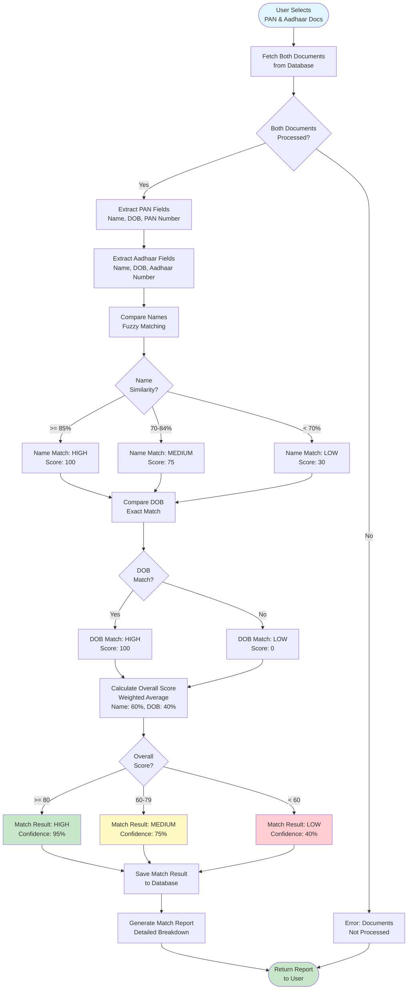
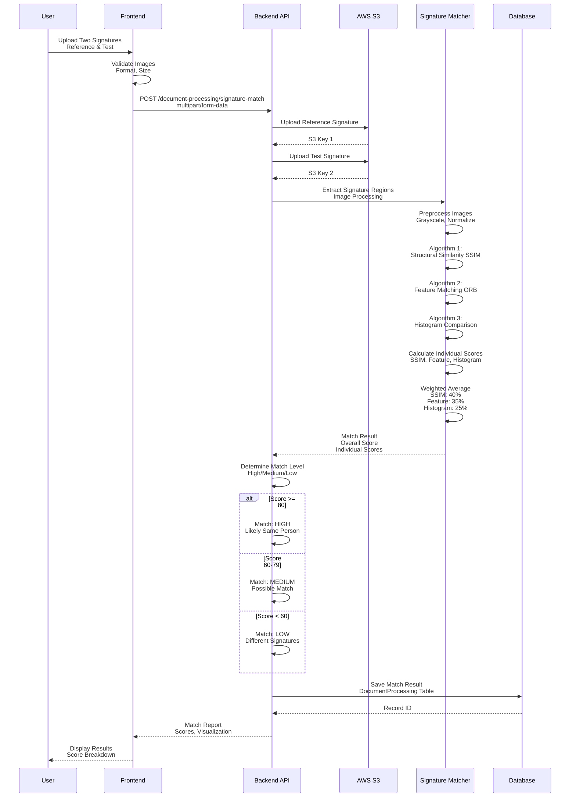
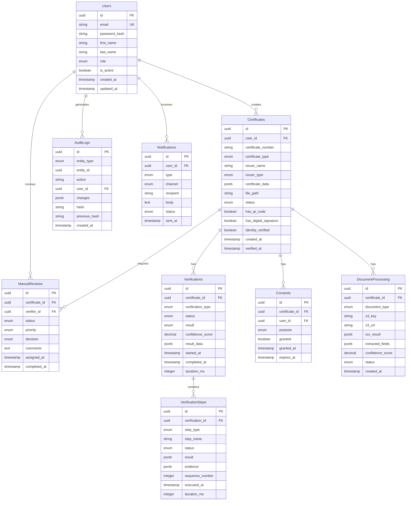
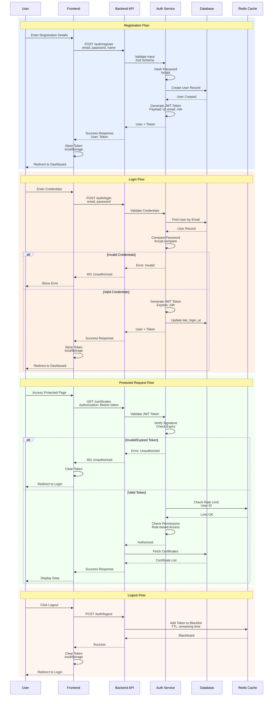

# VeriDoc Certificate Verification System - Architecture & Flow Diagrams

This document contains comprehensive Mermaid.js diagrams illustrating the architecture, data flows, and processes of the VeriDoc Certificate Verification System.

## Table of Contents

1. [System Architecture Diagram](#1-system-architecture-diagram)
2. [Document Upload Flow](#2-document-upload-flow)
3. [Verification Pipeline Flow](#3-verification-pipeline-flow)
4. [Aadhaar Verification Flow](#4-aadhaar-verification-flow)
5. [PAN Verification Flow](#5-pan-verification-flow)
6. [PAN-Aadhaar Matching Flow](#6-pan-aadhaar-matching-flow)
7. [Signature Matching Flow](#7-signature-matching-flow)
8. [Database Schema Diagram](#8-database-schema-diagram)
9. [Authentication Flow](#9-authentication-flow)
10. [Component Architecture](#10-component-architecture)

---

## 1. System Architecture Diagram

This diagram shows the high-level system architecture with all major components and their interactions.

**Description:** The system follows a layered architecture with React frontend, Express.js backend, AWS services for document processing, mock external APIs for verification, and PostgreSQL + Redis for data persistence.

---

## 2. Document Upload Flow

This diagram illustrates the complete document upload and processing pipeline for Aadhaar/PAN cards.

**Description:** Users upload documents which are stored in S3, processed through Textract for OCR, analyzed by Bedrock for field extraction, validated, and presented for user review before final submission.

---

## 3. Verification Pipeline Flow

This diagram shows the multi-step verification process for educational certificates.

**Description:** The verification pipeline adapts based on certificate type, running appropriate checks through multiple services, calculating confidence scores, and determining final verification status.

---

## 4. Aadhaar Verification Flow

This diagram details the Aadhaar card verification process with demographic matching.

**Description:** Aadhaar verification validates format using Verhoeff algorithm, simulates UIDAI API calls with realistic delays and error rates, performs demographic matching with fuzzy logic, and updates certificate identity status.

---

## 5. PAN Verification Flow

This diagram shows the PAN card verification process including Aadhaar linkage check.

**Description:** PAN verification validates format, extracts holder category, performs name/DOB matching with fuzzy logic, checks Aadhaar linkage status, and updates certificate accordingly.

---

## 6. PAN-Aadhaar Matching Flow

This diagram illustrates the cross-document matching process for PAN and Aadhaar cards.

**Description:** PAN-Aadhaar matching compares name fields using fuzzy matching with Levenshtein distance, performs exact DOB comparison, calculates weighted scores, and generates detailed match reports.

---

## 7. Signature Matching Flow

This diagram shows the signature comparison and matching process.

**Description:** Signature matching uses multiple algorithms including SSIM for structural similarity, ORB for feature detection, and histogram comparison, combining scores with weighted averaging to determine match confidence.

---

## 8. Database Schema Diagram

This entity-relationship diagram shows the complete database structure.

**Description:** The database schema uses PostgreSQL with UUID primary keys, JSONB for flexible data storage, enums for type safety, and proper foreign key relationships. Audit logs implement hash chaining for tamper-evidence.

---

## 9. Authentication Flow

This diagram illustrates the JWT-based authentication and authorization process.

**Description:** Authentication uses JWT tokens with bcrypt password hashing, role-based access control, Redis for rate limiting and token blacklisting, and automatic token expiry after 24 hours.

---

## 10. Component Architecture

This diagram shows the frontend component hierarchy and state management.

```mermaid
graph TB
    subgraph "Application Root"
        App[App.tsx<br/>Router Setup]
    end
    
    subgraph "Layout Components"
        Layout[Layout.tsx<br/>Main Container]
        Header[Header.tsx<br/>Top Navigation]
        Sidebar[Sidebar.tsx<br/>Side Menu]
    end
    
    subgraph "Page Components"
        Dashboard[DashboardPage<br/>Overview Stats]
        Certificates[CertificatesPage<br/>List View]
        Upload[UploadCertificatePage<br/>Form + Upload]
        Verifications[VerificationsPage<br/>List View]
        VerDetail[VerificationDetailPage<br/>Details + Steps]
        PANAadhaar[PANAadhaarMatchingPage<br/>Matching Tool]
        Signature[SignatureMatchingPage<br/>Comparison Tool]
        ReviewQueue[VerifierQueuePage<br/>Manual Reviews]
        Profile[ProfilePage<br/>User Settings]
    end
    
    subgraph "Feature Components"
        CertList[CertificateList<br/>Table Component]
        CertCard[CertificateCard<br/>Card Display]
        CertForm[CertificateForm<br/>Input Form]
        AadhaarForm[AadhaarCardForm<br/>Identity Form]
        PANForm[PANCardForm<br/>Identity Form]
        VerCard[VerificationCard<br/>Status Display]
        VerTimeline[VerificationTimeline<br/>Step Progress]
        VerEvidence[VerificationEvidence<br/>Proof Display]
        PANMatcher[PANAadhaarMatcher<br/>Match Component]
        SigMatcher[SignatureMatcher<br/>Compare Component]
        ReviewCard[ReviewCard<br/>Review Item]
    end
    
    subgraph "Common Components"
        Button[Button<br/>Reusable]
        Input[Input<br/>Form Field]
        Select[Select<br/>Dropdown]
        Modal[Modal<br/>Dialog]
        Table[Table<br/>Data Grid]
        FileUpload[FileUpload<br/>File Input]
        Badge[Badge<br/>Status Tag]
        Spinner[LoadingSpinner<br/>Loading State]
    end
    
    subgraph "State Management - Zustand"
        AuthStore[authStore<br/>User, Token, Login/Logout]
        CertStore[certificateStore<br/>Certificates, CRUD]
        VerStore[verificationStore<br/>Verifications, Steps]
        UIStore[uiStore<br/>Theme, Notifications]
    end
    
    subgraph "Services - API Layer"
        AuthService[authService<br/>Login, Register, Logout]
        CertService[certificateService<br/>CRUD Operations]
        VerService[verificationService<br/>Start, Get Status]
        DocService[documentProcessingService<br/>Upload, Process, Match]
        APIService[apiService<br/>Axios Instance]
    end
    
    App --> Layout
    Layout --> Header
    Layout --> Sidebar
    Layout --> Dashboard
    Layout --> Certificates
    Layout --> Upload
    Layout --> Verifications
    Layout --> VerDetail
    Layout --> PANAadhaar
    Layout --> Signature
    Layout --> ReviewQueue
    Layout --> Profile
    
    Certificates --> CertList
    CertList --> CertCard
    Upload --> CertForm
    Upload --> AadhaarForm
    Upload --> PANForm
    Upload --> FileUpload
    
    Verifications --> VerCard
    VerDetail --> VerTimeline
    VerDetail --> VerEvidence
    
    PANAadhaar --> PANMatcher
    Signature --> SigMatcher
    ReviewQueue --> ReviewCard
    
    CertForm --> Input
    CertForm --> Select
    CertForm --> Button
    CertList --> Table
    CertCard --> Badge
    
    Dashboard --> AuthStore
    Certificates --> CertStore
    Upload --> CertStore
    Verifications --> VerStore
    VerDetail --> VerStore
    Profile --> AuthStore
    Header --> UIStore
    
    CertStore --> CertService
    VerStore --> VerService
    AuthStore --> AuthService
    PANMatcher --> DocService
    SigMatcher --> DocService
    
    CertService --> APIService
    VerService --> APIService
    AuthService --> APIService
    DocService --> APIService
    
    style App fill:#e1f5ff
    style AuthStore fill:#fff4e6
    style CertStore fill:#fff4e6
    style VerStore fill:#fff4e6
    style UIStore fill:#fff4e6
    style APIService fill:#f3e5f5
```

**Description:** The frontend follows a component-based architecture with React, using Zustand for state management, service layer for API calls, reusable common components, and feature-specific components organized by domain.

---

## Diagram Usage Notes

### Viewing Diagrams
- These Mermaid.js diagrams can be viewed in:
  - GitHub (native Mermaid support)
  - VS Code (with Mermaid extension)
  - Online editors like mermaid.live
  - Documentation sites supporting Mermaid

### Diagram Types Used
- **Flowchart (graph TB/TD)**: System architecture, process flows
- **Sequence Diagram**: API interactions, time-based flows
- **Entity-Relationship Diagram**: Database schema
- **Flowchart (flowchart TD)**: Decision trees, conditional logic

### Color Coding
- **Blue (#e1f5ff)**: Entry points, start nodes
- **Green (#c8e6c9)**: Success states, completion
- **Red (#ffcdd2)**: Error states, failures
- **Yellow (#fff9c4)**: Warning states, manual review
- **Orange (#fff4e6)**: Processing states, middleware
- **Purple (#f3e5f5)**: Data storage, databases

---

## Document Information

**Version:** 1.0  
**Last Updated:** 2025-10-13  
**Created By:** VeriDoc Architecture Team  
**Status:** Complete

**Related Documents:**
- [ARCHITECTURE.md](./ARCHITECTURE.md) - Detailed system architecture
- [DATA_MODELS.md](./DATA_MODELS.md) - Database schemas and models
- [API_SPECIFICATION.md](./API_SPECIFICATION.md) - API endpoint documentation
- [TECHNOLOGY_STACK.md](./TECHNOLOGY_STACK.md) - Technology choices and rationale

---

**Note:** These diagrams represent the current system design. For implementation details, refer to the source code and related documentation files.